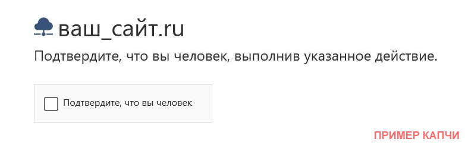
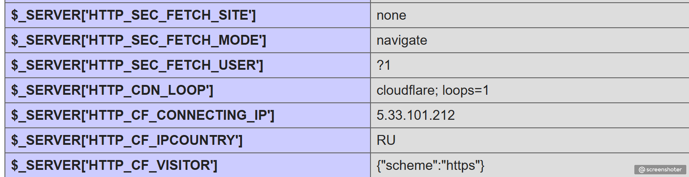

# Инструкция



Данная программа предназначена для блокировки ботов, которые умеют эмулировать браузер, JavaScript, а так же классических ботов.

Программа проверяет посетителя по настроенным фильтрам, и в зависимости от результата выводит капчу, блокирует или пропускает пользователя.

Основные фильтры:

* Белый список ip, network
* Индексирующие роботы (определяет полезных ботов по обратной DNS записи)
* Черный список ip, network
* Исключение по User-agent (для ваших ботов)
* Исключение по URL (например для JSON и REST API)
* Без JavaScript (блокировка, кроме исключений)
* Без Cookie (блокировка, кроме исключений)
* IPv6
* Протокол HTTP
* Мобильный девайс
* Прямые заходы
* Открытие сайта в iframe
* Переход из Tor-сети
* Анализ User-Agent
* Блокировка по FingerPrint
* Блокировка по ASN
* и другое

Вкл/выкл каждого пункта настраивается в конфигурационном файле.

При первом открытии страницы, программа проверяет совпадения из белого/черного списков, список индексирующих робот, user-agent. Если ни одно из правил не сработало, то открывается страница заглушка, в которой делаются дополнительные проверки, требующие определённое время. В процессе проверки отображается индикатор прогресса. В зависимости от результата, страница может попросить пользователя пройти капчу (сейчас работает только простая капча) или же заблокировать его.

Программа обеспечивает максимальную производительность, не использует базу данных и другие ресурсозатратные операции.

## Технические требования
* PHP >= 5.6.4 (тестировался на PHP 5.6.4 и 7.1.33, 8.3.15)
* SQLite

## Быстрый старт

1. Распакуйте файлы проекта в папку /antibot/
2. Дайте права на запись папкам lists/, logs/
3. Перейдите по адресу https://сайт.рф/antibot/ и убедитесь, что нет ошибок
4. Автоматически будет создан файл настроек config.ini
5. В белый список добавятся ip вашего домена.
6. Вставьте следующую строку в начало вашего кода. Обычно это index.php в корне сайта.

```
require_once $_SERVER['DOCUMENT_ROOT'].'/antibot/index.php';
```

7. Проверьте работу сайта
8. Проверьте лог на наличие предупреждений
9. Готово

## Обновление

В систему встроена функция загрузки последних изменений из репозитория github.com. Для этого предусмотрены следующие настройки в config.ini:

```
[sysupdate]
enabled = Off ; On - обновит систему при следующем запуске
branch = dev ; master - стабильный выпуск, dev - для тестировщиков
lastupdate = "2025-05-19 00:13:32" ; дата последнего обновления системы
```

Если выставить enabled = On, то при следующем посещении сайта, система проверит новую версию, скачает её и установит. После чего параметр установится в Off. Обычно обновление занимае не более 3(трех) секунд.

Папки и файлы logs/, lists/, .git, .gitignore и config.ini не заменяются.

## Работа через прокси, балансировщики, сервисы защиты от DDOS, Cloudflare

При работе через проксирующие системы, сервер передает параметры: IP, протокол, версию протокола в специальных заголовках. Чтобы обеспечить совместимость с системой защиты в неё были добавлены соответствующие настройки.

Пример Nginx конфигурации для передачи IP на основной сервер:

```
location / {
    proxy_pass http://backend_server;
    proxy_set_header X-Forwarded-Proto $scheme;         # http или https
    proxy_set_header X-Forwarded-Http-Version $server_protocol;  # HTTP/1.0, HTTP/1.1, HTTP/2.0
    proxy_set_header Host $host;
    proxy_set_header X-Real-IP $remote_addr;
    proxy_set_header X-Forwarded-For $proxy_add_x_forwarded_for;
}

```

Для правильной работы в файле config.ini необходимо включить блок **header_proxy** и указать соответствующие заголовки как в примере ниже.

```
[header_proxy]
enabled = On ; Включает обработку дополнительных заголовков
header_ip = X-Real-IP ; ip-адрес
header_http_version = X-Forwarded-Http-Version ; версия HTTP
header_protocol = X-Forwarded-Proto ; http или https
```

Для других прокси, могут быть другие заголовки. Чтобы их обнаружить создайте php-файл со следующим содержимым и найдите их в переменной _SERVER.

```
<?php
phpinfo();
?>
```

Пример для Cloudflare



```
[header_proxy]
enabled = On
header_ip = HTTP_CF_CONNECTING_IP
header_http_version = SERVER_PROTOCOL
header_protocol = HTTP_X_FORWARDED_PROTO
```

PS Для платной версии Cloudflare могут быть другие значения.

## Белый список

Файл /lists/whilelist_ip содержит список исключений ip-адресов.

Пример:

```
2001:0db8::85a3:8a2e:0370:7334 #пример для IPv6
5.24.102.211 # пример для IPv4
5.24.102.0/24 # ip/маска
5.24.102.0 - 5.24.102.254 # диапазон
```

## Черный список

Файл /lists/blacklist_ip содержит список заблокированных ip-адресов. В этот список обычно попадают пользователи, которые пытались каким-ли образом обойти механизм проверки на роботность.

Пример файла:

```
32.23.104.201 # c5b4c36d24417e72 tor
32.23.104.202 # manual ip
32.23.104.0/24 # ip/маска
32.23.104.0 - 32.23.104.254 # диапазон
```

В данном примере указан IP-адрес, RayID для удобства поиска и комментарий. В данном случае, причина добавления — посещение из Tor-сети и ручная блокировка.

## Исключения по User-agent

Файл /lists/whitelist_useragent содержит список разрешающих совпадений User-agent. Можно писать регулярные выражения. Правила проверяются поочередно до первого срабатывания.

## Исключения по URL

Файл /lists/whitelist_url содержит список исключений URL адресов и параметров.

Например:

* `/wp-json/` будет пропускать REST API запросы в Wordpress
* реглярное выражение `.*\.xml$` будет пропускать все xml файлы.

Правила проверяются поочередно до первого срабатывания.

## Индексирующие роботы

Файл /lists/indexbot_rules содержит список PTR индексирующих роботов. Указывается домен первого уровня.

*PS Для определения индексирующего робота делается DNS-запрос. Некоторые хостеры устанавливают лимиты на количество обращений к их DNS с одного ip-адреса. Запросы кэшируются, но при высокой посещаемости это может вызвать замедление сайта. В этом случае рекомендуется сменить хостера или отключить защиту. Позже будет добавлен внешний DNS. Проблема встречается редко.*

## Блокировка по FingerPrint

В защите реализована генерация уникального идентификатора браузера посетителя (FingerprintJS). Это позволяет блокировать ip-адреса одного и того же бота.

В список lists/blacklist_fingerprint можно добавить Fingerprint. Если система обнаружит его у посетителя, то добавит ip в черный список.

## Протокол HTTP

Возможность заблокировать ботов, использующих устаревшие версии HTTP-протоколов.

```
[http_checker]
enabled = On ; проверка версии HTTP-протокола
protocols = "HTTP/1.0" ; перечисления протоколов через запятую, HTTP/1.0,HTTP/1.1
action = BLOCK ; ALLOW - разрешить, CAPTCHA - капча, BLOCK - заблокировать, SKIP - пропустить правило
add_blacklist_ip = Off ; On - добавить ip в черный список
```

## Блокировка по ASN

Вы также можете блокировать пользователе и ботов по номерам Автономных Систем (AS), либо настроить показ капчи.

### Как работает?
Добавляйте номера автономных система в файл 'lists/blacklist_asn', например: AS8637, AS8638 и т.д. (каждая запись с новой строки). Система запросит список сетей для каждой AS и добавляет их в кеш, по-которому будет проходить проверка. Посмотреть добавленные сети можно в лог-файле 'logs/antibot.log'.

По-умолчанию, обновление списка настроено на 24 часа, но лучше сделать 7-30 дней, т.к. данные обновляются редко.

*Источник списков: https://github.com/ipverse/asn-ip*

```
[asn_checker]
enabled = On
action = BLOCK ; CAPTCHA - капча, BLOCK - заблокировать, SKIP - ничего не делать
blacklist_asn = "lists/blacklist_asn" ; список
timeout = 2 ; таймаут ожидания ответа в секундах
updateTime = 86400 ; время опроса базы ASN-IP в секундах
url = "https://raw.githubusercontent.com/ipverse/asn-ip/master/as/" ; база ASN-IP
```

## Отдача 404 заголовка в капчу

Можно настроить отдачу 404 заголовка при отображении страницы проверки. Это позволить отсеять ботов, которые обрабатываю 404 ошибку. Для этого установите следующее значение в On.

```
[main]
header404 = On ; отдает на страницу проверки 404 заголовок
```

## Log-файл и отладка

Каждое посещение записывается в лог-файл logs/antibot.log. Тут можно отследить процесс фильтрации и понять причину блокировки. Отключение лога возможно в файле настроек.

```
[main]
debug = Off
```

Отключение логирования повышает скорость фильтрации, т.к. нет необходимости лишний раз писать данные на диск.

Вы также можете настроить ротацию логов.

```
[logs]
max_size = 10 ; Максимальный размер, MB
rotate = 7 ; Количество файлов ротации
```

## Как разблокировать пользователя

Для разблокировки, пользователь должен сообщить RayID и IP, которые отображаются внизу страницы. Используйте их, чтобы найти запись в blacklist_ip, или для поиска причины блокировки.

## Для каких сайтов подходит данная защита

* Wordpress, Joomla, 1С Битрикс, Opencart, Drupal, MODX, Netcat, самописная
* Для любых сайтов на PHP 5.6.4 и старше (тестировался на PHP 5.6.4 и 7.1.33, 8.3.15)

## Автор ПО

EgorNiKO

* GitHub: [https://github.com/githubniko/antibot](https://github.com/githubniko/antibot)
* Telegram: [AntibotWAG Channel](https://egorniko.ru/r/D5) (новости проекта)
* Telegram: [AntibotWAF Chat](https://egorniko.ru/r/D8) (обсуждение проекта)
* [https://dzen.ru/a/Z_lToDqVzXV8-7Jt](https://dzen.ru/a/Z_lToDqVzXV8-7Jt) — статья о том, как я защищал сайт от ПФ ботов.
